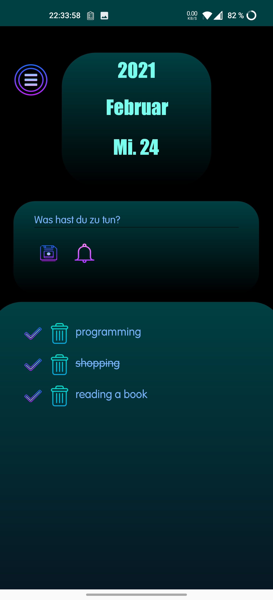

# ToDoApp
A simple ToDoList app for android smartphones. The application was written with android studio in the programming language Java.
All ToDo elements are saved in a sql-database. The connection to this database is realized with java database connectivity (jdbc).
The sourcecode of this application you can find in this repository under ***Sourcecode/app/src/main/java/com/application*** and the design xml files under ***Sourcecode/app/src/main/res/layout***

### Important!
If you like to use this application on your own smartphone you have to do some things before:
1. Import the folder "Sourcecode" into a new android studio project
2. Download the MySQL-JDBC driver from here: https://downloads.mysql.com/archives/c-j/ use not the actual 8.0.22 driver, go to archives and download the 5.1.49
3. In android studio go to File -> Project Structure -> Dependencies -> Click on the "+" symbol -> Choose Jar Dependency and import the mysql-connector-java-5.1.49.jar file
4. You need a mysql or mariaDB database running in your own home network or a database which is public
5. Open the file ***Sourcecode/app/src/main/java/com/application/MySQLConnection.java***
Here you will find this line code:
```java
connection = DriverManager.getConnection("jdbc:mysql://IP-Adress:3306/Database-Name","Database-User","Database-User-Password");
```
  * Change the placeholder ***"IP-Adress"*** to your IP-Adress or Domain where your database is running on
  * Maybe if you use a another port than 3306 change the port ***"3306"*** to the port where your database is listen 
  * Create a new database with the following tables:
  * ***1. Table: Name = ID, Type = int(11), PRIMARY_KEY, AUTO_INCREMENT***
  * ***2. Table: Name = AUFGABE, Type = varchar(50)***
  * ***3. Table: Name = DATUM, Type = varchar(50)***
  * Go back to the MySQLConnection.java file
  * Change the placeholder ***"Database-Name"*** to the name you gave your database
  * Change the placeholder ***"Database-User"*** to the user name which has INSERT, UPDATE, DELETE and SELECT access to your database
  * Change the placeholder ***"Database-User-Password"*** to the password which you gave the user
6. Save the file and start the android emulator or transfer the application to your smartphone
7. This xml-files are optimized for the OnePlus8Pro smartphone. If you have a smartphone with a different resolution, you may have to adjust the xml files for your resolution
8. Run the app and have fun with the Todo-List :)

### Application functions
* A overview over all days and their ToDo´s of the actual month
* Input a ToDo for a specific day and it will saved into a SQL-Database
* Set a notification for a ToDo by setting a specific time in minutes and hours
* Delete a ToDo from the database
* Set a ToDo as done -> The text will be crossed out
* Change the date using a calendar view from android and check all ToDo´s in the past

### Screenshots of the application
* First Picture shows the overview of all specific days in a month. By clicking on a day, the application switches to the activity like picture two. If the todo-list for a day is empty you will see a empty set logo like on So. 14. Is the todo-list filled with one element, you will see one bar, is it filled with two elements, you will see two bars and is it filled with three or more elements, you will see three bars.
* Picture two shows the activity where you can input and save a todo, delete a todo or set a todo as done. The menu button brings you to the activity before and the bell will show you the activity like picture three.
* Picture three shows the notification activity. Here you can set a notification for a specific todo
* If you are clicking on the the date, which is shown in all activities, the application switches to the date change activity like picture four. Here you can choose a date on the calendar and get with the "Zum ToDo" button to the todo-list for the choosed date. Picture five shows a example for the todo-list of a choosed date in the calendar.
<div>
  
  
  
  
  
